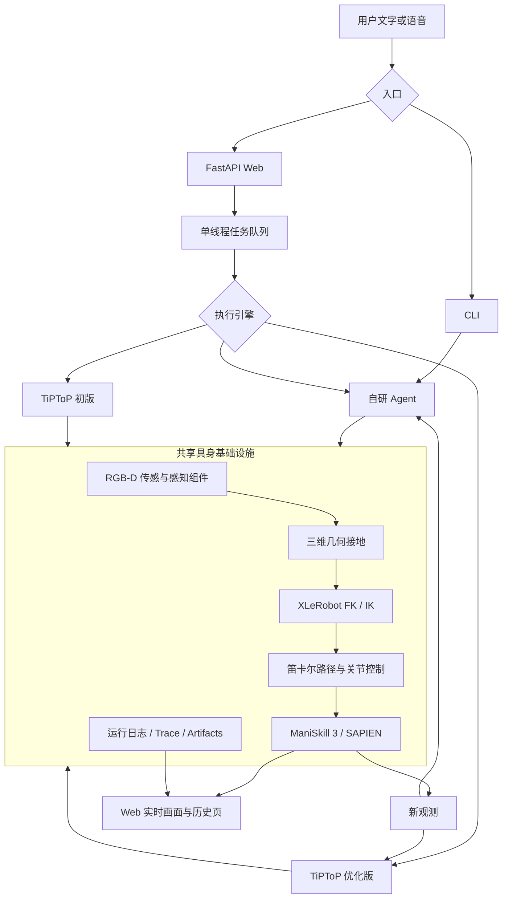
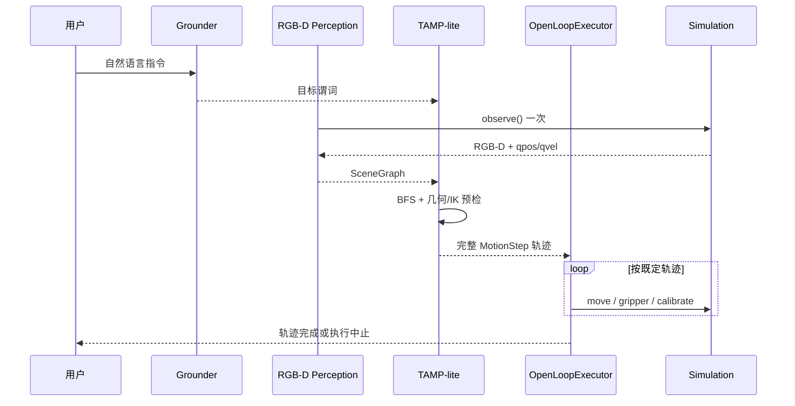
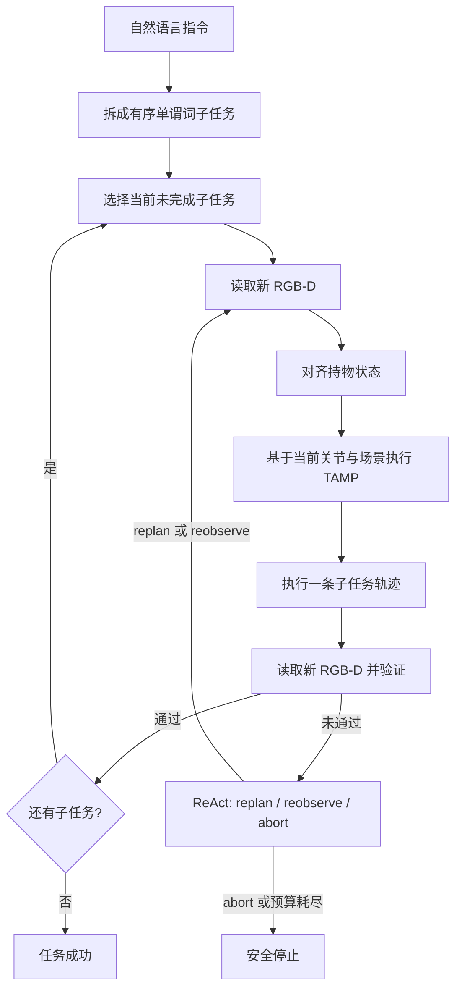
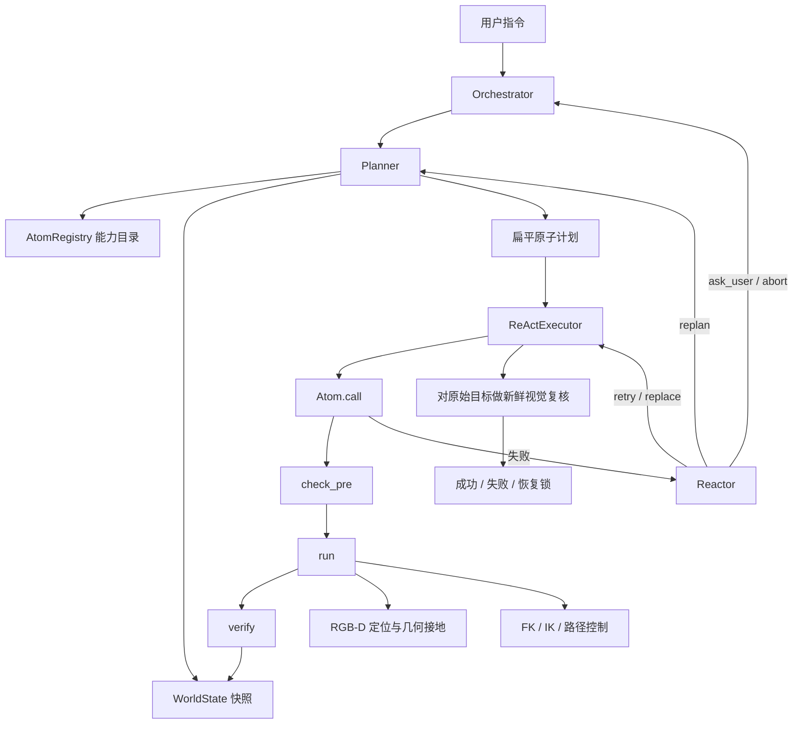
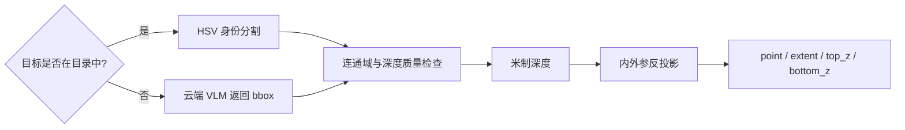

# PickParts 具身 Agent 设计文档

> 基于 ManiSkill 3 / SAPIEN、XLeRobot v0.3 与 RGB-D 闭环控制
> 文档基线：2026-09-22 当前工作区实现

## 阅读导航

- [当前项目配置](#3-当前项目配置)
- [总体架构](#4-总体架构)
- [仿真环境选型](#5-仿真环境选型)
- [具身 Agent 选型](#6-具身-agent-选型)
- [TiPToP 初版设计](#7-tiptop-初版设计)
- [TiPToP 优化版](#8-tiptop-优化版)
- [自研 Agent 结构](#9-自研-agent-结构)
- [三套 Agent 对比](#12-三套-agent-对比)
- [已知限制与演进方向](#15-已知限制与演进方向)

除“已知限制与演进方向”外，本文默认描述**当前已实现行为**；演进项不作为现有
能力承诺。

## 1. 文档摘要

PickParts 是一个面向桌面抓放任务的具身 Agent 原型。系统在 Apple Silicon Mac
上运行 ManiSkill 3 仿真，以 XLeRobot v0.3 轮式双臂机器人为身体，当前锁定
底盘和左臂，仅使用右臂完成物块定位、抓取、入盒、叠放和桌面放置。

系统坚持三个核心原则：

1. **非特权观测**：Agent 只使用 RGB-D、相机标定和机器人本体状态，不读取
   物体真值位姿、接触真值、奖励或环境成功标志。
2. **语义与控制分离**：LLM 负责理解目标、选择谓词或原子动作，不直接生成
   机械臂坐标、关节角和控制量。
3. **物理结果可验证**：动作执行完成不等于任务成功；闭环 Agent 必须通过新的
   RGB-D 观测确认最终物体关系。

当前同时保留三套执行引擎：

| 执行引擎 | 定位 | 核心特征 | 成功判定 |
| --- | --- | --- | --- |
| 自研 Agent | 默认主线 | 扁平原子计划、逐原子校验、通用 ReAct | 计划内终局 `verify_state` 复核 |
| TiPToP 初版 | 对照基线 | 一次性感知、全局 TAMP、整条轨迹开环执行 | 轨迹执行完成 |
| TiPToP 优化版 | 融合路线 | 有序子任务、逐段 TAMP、视觉检查点、有界 ReAct | 每个子任务逐段视觉验证通过 |

三套引擎共享同一套仿真、RGB-D 输入、运动学、低层运动、Web 控制台和可观测性
基础设施；感知算法可以按引擎组织。这些公共边界为同场景、同随机种子的 A/B
实验提供了基础，但当前尚未形成覆盖三套引擎的统一自动 benchmark。

---

## 2. 项目目标与范围

### 2.1 当前目标

系统接收中文自然语言指令，在动态桌面场景中完成以下任务：

- 将任意物块放入任意盒子；
- 将一个物块叠放到另一个物块上；
- 将物块从盒子或其他物块上取下并放回桌面；
- 执行带有明确顺序的多阶段任务；
- 在可恢复失败后重新观测、重新规划或安全停止；
- 记录从语言理解到动作验证的完整运行轨迹。

典型指令包括：

```text
把 A 放进 box
把 A 放到 B 上
先把 A 放到桌面，再把 A 放回 box
把 A 拿起来，再放回原来的盒子
```

### 2.2 当前边界

- 机器人底盘锁定，不包含导航、建图和自动停靠；
- 左臂、头部和左夹爪保持初始化目标，不进行双臂协同；
- 工作空间以单个固定 RGB-D 相机为主，没有腕部相机；
- 任务对象限定为场景目录中的 `block`、`box` 以及虚拟支撑面 `table`；
- 当前几何和抓取策略主要针对 `24 × 24 × 36 mm` 物块；
- 不包含真实 XLeRobot 控制接口和 sim-to-real 验收；
- 不在本地部署 VLM/VLA 权重，语言与开放描述识别通过远程 API 完成。

`table` 不是可定位的实体对象，而是由深度图运行时测量得到的虚拟支撑面。它只可
作为关系目标，例如 `on(A, table)`，不能用于 `find_object(table)`、
`carry_to(table)` 或把它当作普通物体执行 `place_on(table)`。

---

## 3. 当前项目配置

### 3.1 软件栈

| 层级 | 当前配置 | 用途 |
| --- | --- | --- |
| 操作系统 | macOS / Apple Silicon | 本地开发、仿真与演示 |
| Python | `>=3.11,<3.12` | Agent、仿真和 Web 统一运行时 |
| 仿真框架 | ManiSkill `3.0.1` | 环境、机器人、观测和控制器抽象 |
| 物理/渲染 | SAPIEN `3.0.3` | 刚体物理、URDF articulation、RGB-D 相机 |
| 机器人 | XLeRobot v0.3 资产 | 轮式双臂机器人形态 |
| 数值计算 | NumPy `2.4.6`、SciPy `1.17.1` | 几何计算和数值 IK |
| 视觉 | OpenCV `5.0.0.93` | HSV 分割、连通域和深度几何检查 |
| 运动学 | XLeRobot URDF + SciPy `least_squares` | 右臂 FK/IK |
| 模型访问 | OpenAI 兼容 API | LLM 规划、ReAct 和可选 VLM/ASR |
| Web | FastAPI + Uvicorn | 控制台、任务队列和 Trace 查询 |
| 测试 | pytest + Node test runner | Python、接口、物理仿真和前端回归 |

版本定义以 [`pyproject.toml`](../pyproject.toml) 为准。Qwen-Agent 仍作为兼容
依赖保留，但当前主链路使用项目内的 `JSONChat + Planner + Executor + Reactor`
编排，不依赖 Qwen-Agent 的 Assistant 循环。

### 3.2 运行配置

ManiSkill 环境采用：

```text
robot_uids    = "pickparts_xlerobot"
obs_mode      = "rgbd"
control_mode  = "pd_joint_pos"
reward_mode   = "none"
sim_backend   = "cpu"
render_backend= "cpu"
```

这里的 `cpu` 是 ManiSkill 后端配置。macOS 图形设备仍通过 Vulkan/MoltenVK
映射到 Metal，不应将其描述为完全不使用 GPU 的软件渲染。

默认 Web 地址：

```text
http://127.0.0.1:8765
```

模型端点通过 `.env` 或系统环境变量配置：

| 配置组 | 变量 | 说明 |
| --- | --- | --- |
| LLM | `LLM_API_KEY`、`LLM_BASE_URL`、`LLM_MODEL` | Planner、Grounder、Reactor |
| VLM | `VLM_API_KEY`、`VLM_BASE_URL`、`VLM_MODEL` | 开放文本目标的二维 bbox |
| ASR | `ASR_API_KEY`、`ASR_BASE_URL`、`ASR_MODEL` | 可选语音转写 |
| 日志 | `PICKPARTS_LOG_DIR` | Trace 和产物根目录 |
| 日志 | `PICKPARTS_LOG_RETENTION_DAYS` | 默认保留 7 天 |
| 日志 | `PICKPARTS_LOG_LEVEL` | `debug/info/warning/error` |

真实凭据只存放于本地 `.env`，不进入设计文档、日志和版本库。

### 3.3 场景配置

| 对象 | 当前实现 |
| --- | --- |
| 桌面 | 约 `0.60 × 0.44 × 0.05 m`，带四条桌腿 |
| 地面 | `4 × 4 m` 静态刚体 |
| 默认物块 | 红色 `A`、蓝色 `B` |
| 默认容器 | 绿色 `box`，由底板和四面真实碰撞墙组成 |
| 动态对象 | 可添加 `block_N` 和 `box_N` |
| 对象上限 | 当前最多 6 个 |
| 布局 | 随机、互不重叠、完整位于桌面、通过多高度 IK 可达性筛选 |

场景目录只向 Agent 暴露：

```json
{
  "id": "A",
  "kind": "block",
  "label": "红色物块 A",
  "color": [0.85, 0.045, 0.03]
}
```

对象初始位姿和 SAPIEN actor 保留在私有场景构造层。重置场景时保留对象目录，
重新生成所有对象的随机可达位置。

### 3.4 机器人与动作空间

XLeRobot 模型包含：

- 左右臂各 5 个运动关节；
- 左右夹爪；
- 2 个头部关节；
- 固定化的移动底盘。

ManiSkill 控制器覆盖 14 个关节目标，但业务层只改变右臂 5 个关节和右夹爪。
其余关节保持初始化目标。右臂关节命令采用平滑插值执行，跟踪误差超过
`0.12 rad` 时判定动作失败。

右臂 IK 使用 XLeRobot URDF 建链，通过 SciPy `least_squares` 求解 5-DoF
位置与抓取轴约束。TCP 使用项目标定偏移，IK 位置误差要求小于 3 mm。较长的
直线移动按约 8 mm 生成笛卡尔路点，并逐点求解 IK。

### 3.5 相机与观测

| 相机 | 配置 | 用途 |
| --- | --- | --- |
| `workspace` | 640×480 固定 RGB-D，相机位于桌面前上方 | Agent 感知与视觉验证 |
| `overview` | 960×720 | Web 人类观察画面 |

Agent 接收的 `Frame` 仅包含：

```text
rgb
depth                  # 米制深度
intrinsic              # 相机内参
camera_to_base         # 相机到机器人基座外参
qpos
qvel
```

环境的 `evaluate()` 和额外观测不返回奖励、成功标志或对象真值。

### 3.6 macOS 运行约束

SAPIEN/Vulkan 在 macOS 上有明确的线程约束：

1. 首次 Vulkan 设备初始化必须发生在主线程；
2. Web 启动前在主线程创建并关闭一次 `Simulation` 完成预热；
3. FastAPI 请求线程不得直接访问仿真器；
4. 命令、重置、添加对象和切换 Agent 全部进入任务队列；
5. 唯一的 `pickparts-simulation` 守护线程串行访问 SAPIEN；
6. UI 共享状态使用 `RLock` 保护。

这一约束是运行时安全边界，不只是性能优化。绕过队列从 Web 请求线程直接读写
仿真器，可能导致 macOS 渲染崩溃。

---

## 4. 总体架构



总体上分为六层：

| 层 | 职责 |
| --- | --- |
| 交互层 | 文本/语音输入、Agent 选择、场景管理和状态展示 |
| 认知层 | 指令解析、谓词或原子计划、失败反思 |
| 执行层 | 预算、步骤调度、恢复策略和完成判定 |
| 感知/几何层 | RGB-D 定位、桌面测量、关系判断和坐标接地 |
| 运动层 | FK/IK、路径插值、关节跟踪和夹爪时序 |
| 仿真层 | 机器人、场景、相机和刚体物理 |

可观测性作为横切能力贯穿全部层，而不是仅记录最终成功或失败。

---

## 5. 仿真环境选型

### 5.1 为什么选择 ManiSkill 3 / SAPIEN

当前阶段的主要约束不是大规模训练吞吐，而是：

- Apple Silicon Mac 本地可运行；
- 可加载自定义 XLeRobot URDF；
- 能提供真实 RGB-D、相机标定和机器人本体状态；
- 能执行有接触的抓取、释放和堆叠；
- 能严格隔离仿真真值与 Agent 观测；
- 开发成本足够低，可快速验证闭环 Agent。

ManiSkill 3 直接提供 `BaseEnv`、`BaseAgent`、PD 控制器、传感器和统一观测接口；
SAPIEN 提供底层物理、渲染和 articulation。二者的组合避免了从零实现环境生命周期、
机器人控制器和相机接口，同时保留足够的场景定制能力。

### 5.2 候选平台比较

| 方案 | 优势 | 当前不采用的原因 |
| --- | --- | --- |
| ManiSkill 3 / SAPIEN | Mac 已验证；自定义 URDF 和 RGB-D 接口直接；现有代码完整 | 当前主选 |
| Isaac Sim / Isaac Lab | 传感器、GPU 训练和域随机化能力强 | 依赖 NVIDIA/RTX，当前 Mac 不支持 |
| MuJoCo | 跨平台、控制和接触仿真成熟 | 迁移需重建当前环境、传感器和控制适配，近期收益有限 |
| RoboTwin 2.0 | 双臂任务、专家轨迹和 benchmark | 依赖 Linux/CUDA，无 XLeRobot 适配 |
| 直接使用 SAPIEN | 控制力最强 | 需重复实现 ManiSkill 已提供的环境和控制器抽象 |

RoboTwin 与 StarVLA 曾作为早期研究路线，但没有成为当前运行依赖。RoboTwin 更适合
未来在独立 Linux GPU 环境中承担双臂数据生成和 benchmark；VLA 则适合在数据与
硬件条件成熟后作为局部 learned atom，而不是直接接管当前全局完成判定。

### 5.3 为什么选择 XLeRobot

XLeRobot 具备轮式底盘和双机械臂形态，比旧 Panda 单臂 PoC 更接近目标机器人。
项目固定使用上游资产 revision：

```text
a7ee564294f03484783ed053ab1550bccc3c6c09
```

当前先固定底盘、单臂执行，是为了把问题集中到感知、规划、抓放和验证闭环。后续
扩展底盘导航或双臂协同，可以复用现有语义计划与观测边界，但必须新增动作空间、
碰撞约束和多执行器调度，不能只解除关节锁定。

---

## 6. 具身 Agent 选型

### 6.1 为什么选择 TiPToP

TiPToP 是模块化的 Task and Motion Planning 系统。它将语言、感知、对象中心
场景表示、符号任务规划、几何可行性检查和机器人执行分离，核心链路是：

```text
自然语言 + 图像
  -> 对象中心三维场景
  -> 目标谓词
  -> 符号状态搜索
  -> 几何/IK 可行性检查
  -> 机器人轨迹
```

它适合作为本项目的重要参考与对照系统，原因如下：

1. **符合语义规划原则**：语言模型输出对象 ID 和关系谓词，不负责坐标与关节控制。
2. **显式物理约束**：TAMP 在搜索阶段结合几何和 IK，比仅由 LLM 拼接动作更容易审计。
3. **不依赖目标机器人示范数据**：适合当前缺少 XLeRobot 专用数据集的阶段。
4. **组件边界清楚**：感知、语言接地、任务搜索、轨迹生成和执行失败可分别定位。
5. **适合做对照实验**：其一次性全局规划和开环执行与自研 ReAct 闭环形成明确变量。

官方 TiPToP 依赖 CUDA、cuTAMP/cuRobo 及多个 GPU 感知组件，不能在当前 Mac 环境
原样运行。本项目保留其控制结构，将实现替换为：

| 官方方向 | 本项目 Mac/CPU 适配 |
| --- | --- |
| GPU 深度与对象感知 | ManiSkill RGB-D + HSV/深度几何 |
| GPU 并行 TAMP | Python 符号 BFS |
| cuRobo 运动规划 | SciPy IK + 笛卡尔路点验证 |
| 官方机器人栈 | XLeRobot 右臂 + ManiSkill PD 控制 |

因此，`tiptop_mac` 是 **TiPToP 风格的本地对照实现**，不是官方代码的无改动移植。

### 6.2 为什么仍然需要自研 Agent

TiPToP 的模块化 TAMP 很适合生成可解释轨迹，但初版缺少项目所需的执行期闭环：

- 轨迹开始后环境可能与计划时观测不同；
- 抓取闭合不代表物体已被稳定抓起；
- 释放命令成功不代表目标已位于支撑物上；
- 多阶段指令不能只检查最终状态；
- 失败后需要区分重试、替换动作、重规划、询问用户和停止；
- macOS 单线程仿真、Web 生命周期与运行追踪需要项目级编排。

自研的重点并不是重写 LLM、仿真器或 IK，而是实现 **具身任务闭环编排层**：

```text
受限能力目录
  + 非特权状态黑板
  + 原子动作契约
  + 执行预算
  + 失败分类
  + ReAct 恢复
  + 最终视觉复核
```

### 6.3 双路线的关系

TiPToP 与自研 Agent 不是简单的替代关系：

- TiPToP 初版提供显式 TAMP 的保真对照；
- 自研 Agent 验证通用原子编排和动作级 ReAct；
- TiPToP 优化版将显式 TAMP 与分段视觉闭环结合；
- 三者共享低层系统，便于判断改进来自 Agent 结构而不是机器人或场景差异。

---

## 7. TiPToP 初版设计

### 7.1 执行链路



### 7.2 语言接地

Grounder 将自然语言转换为谓词，例如：

```text
on(A, box)
on(A, B)
holding(A)
```

对象参数必须来自场景目录，`table` 仅作为支撑关系使用。语言层不产生位置、姿态、
关节值或自由形式代码。

### 7.3 对象中心场景

初版在任务开始时读取一次 RGB-D，并构建：

```text
SceneGraph
  table:
    top_z
    normal
    bounds
  objects[id]:
    kind
    point
    extent
    top_z
    bottom_z
    grasp candidates
  qpos
```

桌面来自深度点云的支撑面测量；物体通过颜色身份、连通域和深度反投影定位。
SceneGraph 不读取 actor pose。

### 7.4 TAMP-lite

符号状态为：

```text
State(
  held: object_id | None,
  support: {(block, support), ...}
)
```

可用操作为：

```text
pick(block)
place(block, table | block | box)
```

BFS 最大搜索 500 个状态，并禁止将物体放到自身或其后代上，避免形成支撑环。
找到符号路径后，规划器再生成完整的 `move/gripper/calibrate` 轨迹，并进行：

- 抓取候选存在性检查；
- 物块与支撑面的 footprint 适配检查；
- 目标位置邻近碰撞检查；
- 关键点 IK 检查；
- 抓取后的物体-TCP 偏移标定。

### 7.5 开环执行语义

初版在规划后不重新感知、不重新规划、不做最终目标验证。执行过程中插入的
`calibrate` 用于测量抓起后物体相对 TCP 的偏移，并修正后续轨迹；它是确定性的
运动学标定，不依据任务结果做分支，因此不属于 ReAct。

初版的 `success=True` 只表示整条轨迹执行完成，不能解释为目标关系已通过视觉确认。
规划或感知阶段失败不会设置恢复锁；一旦进入执行器，任一步失败都会按执行中止
处理并设置恢复锁。

保留这一限制是有意的：初版承担 A/B 对照基线，不能在不更名的情况下逐步加入
闭环行为，否则会失去实验可比性。

---

## 8. TiPToP 优化版

### 8.1 优化目标

优化版保留 TiPToP 的对象中心表示和显式 TAMP，同时解决三个主要问题：

1. 只表达最终谓词会丢失用户要求的中间过程；
2. 一次性感知和开环执行无法应对物理偏差；
3. 初始状态与目标状态相同时，BFS 可能错误返回空计划。

优化后的主循环为：



每个子任务默认最多尝试 5 次。已完成前缀不会重放。

### 8.2 有序任务拆解

`OrderedGrounder` 将指令拆成最多 16 个扁平、有序、单谓词子任务：

```json
{
  "subtasks": [
    {
      "instruction": "把 A 放到桌面",
      "goal": [{"predicate": "on", "args": ["A", "table"]}],
      "require_action": false
    },
    {
      "instruction": "把 A 放回盒子",
      "goal": [{"predicate": "on", "args": ["A", "box"]}],
      "require_action": false
    }
  ],
  "rationale": "先离开盒子，再回到盒子"
}
```

拆解器必须保留“先……再……”和重复动作，不允许只保留最终状态，也不能增加用户
没有要求的目标。

### 8.3 过程里程碑与 BFS 状态

对于“重新拿起再放回”这类任务，仅检查最终 `on(A, box)` 不足以证明动作发生。
优化版引入：

```text
State(
  held,
  support,
  moved: frozenset[object_id]
)
```

当 `require_action=true` 时，`_satisfied` 除检查最终谓词外，还要求目标对象已进入
`moved` 集合。`moved` 同时进入 BFS 状态键，使“起点 → 抓起 → 放回起点”的合法
动作回路不会被 visited set 提前剪枝。

普通目标如果已满足，仍可返回空计划；只有用户明确要求重新执行动作时才强制过程
里程碑，避免无意义搬运。

### 8.4 单子任务规划

优化版规定一次 TAMP 只处理一个谓词、最多一次物体转移。每段完成后重新感知，
避免跨多个物理阶段继续使用已经过期的抓取几何。

规划输入包括：

- 当前 RGB-D 场景图；
- 当前 5 个右臂关节值作为 IK seed；
- 已确认的持物对象；
- 视觉测得的物体相对 TCP 偏移；
- 当前子任务已排除的失败桌面落点。

### 8.5 完整路径 IK 预检

初版主要检查关键目标点。真实执行则会按约 8 mm 插值笛卡尔路径，因此端点可达
并不能保证中间路点可达。

优化版复用执行器相同的 `_cartesian_waypoints`，从实时关节状态开始逐点求解 IK：

```text
当前 arm qpos
  -> waypoint 1 IK
  -> 以上一解作为 waypoint 2 seed
  -> ...
  -> 目标点
```

持物移动时，每个待验证点还会叠加实测的物体-TCP 偏移。这样规划器验证的轨迹与
执行器最终发送的 TCP 轨迹一致，避免“名义 TCP 可达、叠加抓取偏移后不可达”。

首次抓取前尚未获得真实偏移，只能预检名义路径；抓起并完成视觉标定后，后续恢复
规划全部使用实测偏移。

### 8.6 失败落点排除

桌面放置不是返回物块旧位置，而是在实测桌面范围内搜索候选点。候选点需要满足：

- 物块 footprint 完整位于桌面；
- 与其他对象及盒沿保持夹爪所需间距；
- 完整放置路径通过连续 IK；
- 不落入已知失败点 5 cm 半径范围；
- 每轮最多检查 256 个候选点。

当执行在不可达或验证阶段失败时，规划器提取对应桌面 XY，加入当前子任务的排除
列表。下一次 ReAct 重规划会选择不同位置，防止在工作空间边缘重复失败。

### 8.7 持物状态恢复

优化版不使用单个布尔值表示夹爪状态，而是区分：

```text
empty     已有视觉和本体证据确认空爪
holding   已确认夹住并抬起指定物体
unknown   证据缺失或相互矛盾
```

首次确认抓取至少需要：

- 候选物体仍位于 TCP 附近；
- 夹爪闭合量符合夹持状态；
- 物体相对抓取前产生至少 3.5 cm 的视觉抬升；
- 物体不再得到桌面、盒底或其他物块的支撑。

释放确认需要物体得到有效支撑，并且夹爪张开或已与物体分离。仅执行张爪命令，
或物体接触目标表面，都不足以证明释放完成。

当状态为 `holding` 时，恢复规划可直接从放置继续，不重放抓取；当状态为
`unknown` 时，只允许重新观测或停止，禁止盲目执行。

### 8.8 几何验证改进

优化版让 TAMP 与持物恢复共享主要堆叠几何原则，但盒内遮挡处理保留了不同的
保守边界：

- 物块中心在支撑边缘内至少 2 mm；
- 上层物块与支撑俯视 footprint 至少 50% 重叠；
- 物块底面与支撑顶面的允许间隙为 `-3～8 mm`；
- TAMP 从观测推断盒内关系时使用约 3 mm 的边界容差和可见底面；
- 新放置轨迹的盒内适配检查使用约 6 mm 的内缩；
- 持物恢复对盒内判断使用约 6 mm 的内缩，并以盒底 `bottom_z + 6 mm` 为支撑面；
- 桌面接触优先使用实测底面；
- 只有盒壁遮挡物块底面时，才使用已知 36 mm 高度进行保守补偿。

叠放后重新抓取时，规划器会依次尝试 10、8、6 cm 抬升高度。每个候选的 hover
目标会设置在已观测障碍顶部至少 3 cm 以上，并执行连续路径 IK 预检；当前没有
独立的三维扫掠体碰撞检测。

### 8.9 有界 ReAct

Reactor 输入：

```text
当前子任务
当前尝试次数与剩余预算
已完成子任务数量
失败阶段和 error_kind
完整失败历史
grip_state / held
最新支撑关系
当前目标谓词
```

它只能返回：

| 决策 | 含义 |
| --- | --- |
| `replan` | 基于新场景重新规划当前目标 |
| `reobserve` | 不执行动作，再次读取传感器 |
| `abort` | 无法安全继续，停止当前任务 |

Reactor 不能输出坐标、关节值、新任务或代码。模型调用失败时默认 `reobserve`；
输出格式非法时 fail-closed 为 `abort`。致命运动错误不进入重试，立即停止。

### 8.10 优化版成功语义

优化版只在以下条件全部成立时返回成功：

1. 指令已拆成合法的有序子任务；
2. 每个子任务都在预算内完成；
3. 每段执行后都读取了新的 RGB-D；
4. 当前谓词通过实测场景关系验证；
5. `require_action` 子任务观察到了要求的过程里程碑；
6. 所有子任务按原顺序完成。

---

## 9. 自研 Agent 结构

### 9.1 架构概览



### 9.2 组件职责

| 组件 | 责任 | 不负责 |
| --- | --- | --- |
| `Orchestrator` | 组装组件、管理单轮任务和跨轮历史 | 几何与运动 |
| `Planner` | 将目标变成扁平原子序列，校验语义顺序 | 直接执行动作 |
| `AtomRegistry` | 注册能力、生成模型目录、校验调用参数 | 决定任务目标 |
| `ReActExecutor` | 顺序执行、预算控制、失败分流、最终复核 | 自由生成坐标 |
| `Reactor` | 根据失败上下文选择恢复策略 | 直接访问仿真器 |
| `WorldState` | 保存观测事实、夹爪与持物状态 | 保存 actor 真值 |
| `Atom` | 前置检查、运行时接地、物理执行、后置验证 | 全局任务规划 |

### 9.3 WorldState

`WorldState` 是线程安全的非特权状态黑板，主要保存：

- 对象目录；
- 最近一次视觉位置、bbox、高度和尺寸；
- 对象可见性和观测帧号；
- 已验证的 `on/in/table` 放置关系；
- 夹爪状态；
- 当前持物对象；
- 抓取后测得的物体-TCP 偏移；

普通 `find_object` 只更新几何观测，不根据单个位置点猜测“在桌上”或“在盒里”。
支撑关系必须由 `verify_state` 使用新鲜观测和明确几何规则建立。

### 9.4 Planner

Planner 将自然语言、原子目录和世界状态交给 LLM，要求输出严格 JSON：

```json
{
  "feasible": true,
  "blockers": [],
  "steps": [
    {"atom": "find_object", "args": {"target": "A"}},
    {"atom": "find_object", "args": {"target": "B"}},
    {"atom": "reach_above", "args": {"target": "A"}},
    {"atom": "grasp", "args": {"target": "A"}},
    {"atom": "lift", "args": {}},
    {"atom": "carry_to", "args": {"container": "B"}},
    {"atom": "place_on", "args": {"target": "B"}},
    {"atom": "verify_state", "args": {"target": "A", "at": "B", "relation": "on"}},
    {"atom": "reset_arm", "args": {}}
  ],
  "rationale": "将 A 抓起并叠放到 B 上，再用视觉确认结果。"
}
```

计划必须是顶层扁平有序列表，不允许循环容器或嵌套工作流。模型输出后还会经过：

1. JSON schema 校验；
2. 原子名称与参数校验；
3. 对象引用、`table` 语义和已知目标类型校验；
4. 语义顺序状态机校验。

顺序规则包括：

- 抓取前必须先定位和到达；
- 抓取后必须先抬升再搬运；
- 持物时禁止无条件张爪；
- 放置动作后必须立即验证；
- `table` 不能作为普通可定位对象。

### 9.5 原子动作库

当前默认注册 11 个原子：

| 原子 | 作用 | 主要验证 |
| --- | --- | --- |
| `find_object` | 定位目录对象或开放文本目标 | 可见性、深度质量、定位置信度 |
| `reach_above` | 移动到抓取悬停位 | TCP 位置与关节跟踪 |
| `set_gripper` | 控制夹爪开合 | WorldState 中的逻辑夹爪状态 |
| `grasp` | 下降并闭合夹爪 | 候选与夹爪逻辑状态 |
| `lift` | 抬起并确认真实持物 | 视觉高度变化和物体-TCP 关系 |
| `carry_to` | 将持物移动到目标上方 | 连续 IK、持物状态 |
| `release_into` | 放入盒子并撤离 | 夹爪释放；随后由 `verify_state` 检查盒内几何 |
| `place_on` | 放到另一物块上 | 夹爪释放；随后由 `verify_state` 检查支撑关系 |
| `place_on_table` | 搜索桌面落点并放置 | 桌面支撑与边界 |
| `verify_state` | 验证 `in/on/table` 放置关系 | 新鲜 RGB-D 几何 |
| `reset_arm` | 回到安全姿态 | 关节跟踪 |

每个原子统一实现：

```text
check_pre()
  -> run()
  -> verify()
```

预期的前置、运动和验证失败通过结构化 `AtomResult` 报告；未预期异常会记录到
Trace 后继续上抛，由任务边界统一处理。

### 9.6 参数与坐标边界

LLM 的动作输出只允许引用：

- 原子名称；
- 目录对象 ID，或自研 Agent 允许的受长度约束开放视觉描述；
- 关系；
- 注册表声明的有限语义参数。

坐标和关节控制由原子内部在运行时生成：

```text
object_id
  -> 最新 RGB-D
  -> bbox / mask
  -> 深度质量检查
  -> 三维反投影
  -> 抓取或放置偏移
  -> TCP 目标
  -> 8 mm 路点
  -> 连续 IK
  -> 关节目标
```

当前实现会把包含实测几何的 `WorldState.snapshot()` 提供给 Planner/Reactor 作为
上下文，因此“LLM 不处理坐标”的准确含义是：**模型无权通过输出通道指定坐标，
物理执行也不信任模型生成的坐标**。如果后续需要更严格的信息隔离，可再将输入
快照裁剪为纯语义关系。

### 9.7 ReActExecutor

执行器维护计划指针并逐原子执行。失败时将以下上下文交给 Reactor：

- 原始任务；
- 当前步骤与剩余计划；
- 结构化 `error_kind`；
- 当前世界状态；
- 当前 ReAct 尝试序号；
- 当前失败消息和该原子返回的观测摘要。

默认预算：

| 预算 | 上限 |
| --- | ---: |
| ReAct 决策 | 4 次 |
| 原子调用 | 25 次 |
| LLM 调用 | 8 次 |

预算防止模型在物理环境中无限重试。

### 9.8 Reactor

Reactor 可选择：

| 决策 | 行为 |
| --- | --- |
| `retry` | 使用更新后的观测重试当前原子 |
| `replace` | 用一小段恢复原子替换失败步骤 |
| `replan` | 保留原目标，重新规划未完成部分 |
| `ask_user` | 请求用户澄清或处理不可自动决策的情况 |
| `abort` | 安全停止 |

Reactor 返回公开的简短依据，不展示模型私有思维链。恢复动作会经过
`AtomRegistry` 参数校验和“持物时不得直接张爪”的保护，但当前不会重新运行
Planner 的完整语义顺序校验；其余错误由原子 `check_pre` 在执行前兜底。

当前 Web 构建链路尚未接入可续跑的 `ask_user` 回调，因此该决策会转为失败；
这是已知功能边界，不应在界面上描述为已支持的人机协同恢复。

### 9.9 错误分类与恢复锁

主要错误类型：

```text
precondition
unreachable
lost_object
grip_failed
verify
fatal
```

`fatal` 表示继续执行可能不安全或仿真状态已经不可依赖。此类错误不再调用 LLM，
立即设置 `recovery_required`。Web 在恢复锁期间禁止继续下发任务或切换 Agent，
只允许重置场景。

### 9.10 最终完成判定

执行器按源对象保存 Planner 初始计划中最后一个 `verify_state`，它代表该对象的
终局关系。即使 Reactor 替换或重规划了中间动作，所有动作结束后仍会：

1. 重新读取 RGB-D；
2. 重新定位目标与支撑对象；
3. 重新计算物体关系；
4. 逐项执行已保存的终局 `verify_state`；
5. 全部通过后才返回成功。

模型文本、动作调用成功和旧 WorldState 都不能绕过已登记的终局复核。但当前
Planner 校验器尚未强制计划至少包含一个 `verify_state`，执行器也没有独立解析
自然语言原始目标；如果初始计划漏掉验证项，仍可能在动作完成后返回成功。这是
需要补齐的安全缺口。

---

## 10. 感知与几何接地

### 10.1 双路视觉定位



已知目录对象优先使用本地颜色身份定位，避免让 VLM 猜测已知对象。开放文本目标才
调用 VLM，且 VLM 只接收 RGB、返回二维 bbox；三维位置始终由本地深度和相机标定
计算。

### 10.2 感知拒绝条件

定位器会拒绝：

- 目标贴近图像边缘或可见像素过少；
- bbox 中有效深度覆盖不足；
- 同色目标出现多个显著连通域；
- bbox 内包含不连续的多个深度表面；
- 物块被遮挡到只剩无法稳定求中心的窄条；
- 计算结果包含非有限数或不合理尺寸。

拒绝不等于任务失败。闭环 Agent 可重新观测或重规划；开环初版则在规划前失败。

### 10.3 非特权边界

| 数据 | Agent 可用 | 说明 |
| --- | ---: | --- |
| RGB / depth | 是 | 真实传感器输出 |
| 相机内外参 | 是 | 固定标定 |
| qpos / qvel | 是 | 本体状态 |
| 对象语义目录 | 是 | 不含位置 |
| actor pose | 否 | 仅私有场景构造使用 |
| segmentation ID | 否 | 不进入 Agent |
| contact truth | 否 | 不进入 Agent |
| reward / success flag | 否 | 环境返回空值 |
| 评测真值 | 否 | 当前运行链路不提供 |

---

## 11. Web 控制台与可观测性

### 11.1 统一控制台

Web 控制台支持：

- 在三套 Agent 之间切换；
- 保留场景并重建所选 Agent 会话；
- 输入自然语言任务；
- 实时查看相机画面；
- 查看计划、当前步骤、子任务进度和 ReAct 摘要；
- 随机重置场景；
- 动态添加物块或盒子；
- 跳转当前运行的 Trace；
- 查询历史任务。

运行中或 `recovery_required` 为真时禁止切换引擎；当前引擎为 TiPToP 优化版时，
只要仍存在 `candidate/held` 也禁止切换。自研 Agent 的非致命失败可能保留持物
状态但未设置恢复锁，尚未形成同等级别的切换保护。

### 11.2 Trace 模型

每个操作形成一个 Run，内部使用父子 Span 表示：

```text
run
├── ground / decompose
├── perceive
├── plan
│   └── llm
├── execute
│   ├── atom / motion step
│   ├── grip calibration
│   └── react
└── verify / final_verify
```

每个 Span 记录状态、开始/结束时间、耗时和结构化属性。运行还记录：

- Agent 类型；
- 用户指令；
- 成功、失败和恢复锁状态；
- 原子、ReAct 和 LLM 调用计数；
- 失败类型与异常类别；
- 子任务和尝试次数。

### 11.3 持久化与产物

Trace 按日写入：

```text
logs/trace-YYYY-MM-DD.jsonl
```

`run_end` 会执行 flush 和 `fsync`。关联产物包括：

- RGB 错误现场图；
- 深度、内参、外参和 qpos 的 NPZ；
- 场景图、计划和验证结果 JSON；
- LLM 请求与响应文本。

日志会对常见 API Key 和 Bearer Token 进行脱敏。完整异常栈只保存在本地 JSONL，
HTTP 查询接口仅暴露异常类型。

`/history` 页面提供日期、Agent、状态和关键词筛选，以及分层耗时瀑布图、关联日志
和产物查看。

当前 Trace 是单进程本地层级追踪，不具备 OpenTelemetry/OTLP 导出和跨服务
Trace Context，因此不应称为完整分布式追踪系统。

---

## 12. 三套 Agent 对比

| 维度 | 自研 Agent | TiPToP 初版 | TiPToP 优化版 |
| --- | --- | --- | --- |
| 语言输出 | 扁平原子序列 | 最终目标谓词 | 有序单谓词子任务 |
| 主要规划 | LLM 语义计划 | BFS TAMP | 分段 BFS TAMP |
| 坐标生成 | 原子运行时接地 | TAMP 几何规划 | TAMP + 实测持物偏移 |
| 感知频率 | 原子按需感知 | 规划前一次 | 每次尝试和验证均感知 |
| 路径处理 | 8 mm 路点边求解边执行 | 规划时检查关键点 | 执行前完整验证 8 mm 路点 |
| 失败恢复 | retry/replace/replan/ask_user/abort | 无，立即中止 | replan/reobserve/abort |
| 默认恢复预算 | 4 次 ReAct | 0 | 每子任务最多 5 次尝试 |
| 中间步骤 | 由原子计划表达 | 最终状态可能覆盖过程 | 显式有序子任务与 `moved` 里程碑 |
| 持物状态 | WorldState + 抬升验证 | 抓起后一次标定 | empty/holding/unknown 三态 |
| 失败落点排除 | 由原子/恢复策略决定 | 无 | 桌面失败点 5 cm 排除 |
| 最终成功 | 复核计划中已登记的终局关系 | 轨迹执行完成 | 每段目标视觉验证 |
| 主要价值 | 通用闭环与原子扩展 | 开环 TAMP 对照 | TAMP 与闭环恢复融合 |

不应直接比较三者单次演示的“成功”布尔值，因为初版的成功语义弱于另外两套系统。
正式评测应统一使用外部的视觉/几何结果判据。

---

## 13. 安全与可靠性设计

### 13.1 防止语言模型越权

- 模型输出必须是严格 JSON；
- 无效 JSON 只允许一次格式修复；
- 原子或谓词必须来自白名单；
- TiPToP 对象必须来自目录；自研 Agent 可接受受约束的开放视觉描述；
- 未知参数、非有限数和越界值被拒绝；
- 模型不能直接下发坐标、关节角或代码；
- 模型回复不能直接设置任务成功；
- 恢复步骤必须通过参数级校验和原子前置条件。

### 13.2 防止运动越界

- 场景布局在创建前经过多高度 IK 筛选；
- 自研 Agent 按 8 mm 路点边求解边执行，桌面放置会预检候选路径；
- TiPToP 初版在规划时检查关键点；
- TiPToP 优化版从当前关节状态完整预检连续笛卡尔路径；
- 关节目标采用平滑插值；
- 执行后检查关节跟踪误差；
- 持物规划叠加实测抓取偏移；
- 致命错误立即停止并进入恢复锁。

### 13.3 防止错误成功

- 抓取闭合与真实抬起分开判断；
- 释放命令与物体得到支撑分开判断；
- 关系验证使用新 RGB-D；
- Reactor 不能删除初始计划中已登记的终局验证；
- 自研 Agent 最终重放已登记的终局验证项；
- TiPToP 优化版逐子任务设置视觉检查点；
- UI 明确区分开环完成和视觉确认。

---

## 14. 测试与验收策略

测试分为五层：

| 层级 | 重点 |
| --- | --- |
| 单元测试 | 几何、状态、参数 schema、BFS、ReAct 决策 |
| 组件测试 | 感知、IK、原子、TAMP 和持物恢复 |
| 接口测试 | Web 生命周期、队列、Agent 切换、Trace API |
| 真实仿真测试 | 入盒、叠放、桌面往返、失败恢复 |
| 前端测试 | 三引擎状态、进度、历史页和 Trace 展示 |

推荐固定以下核心任务进行同场景对比：

1. `A -> box`；
2. `A -> B`；
3. `B -> A`；
4. `box -> table -> box`；
5. `A -> B -> box`；
6. 注入一次 IK 或验证失败后的恢复；
7. 持物状态不确定时的安全停止。

统一指标：

- 最终视觉成功率；
- 每任务、对象和 seed 的成功率；
- 感知、规划、执行、验证 P50/P95 耗时；
- 平均动作数和重试次数；
- 恢复成功率；
- 错误继续执行次数；
- 错误成功报告次数；
- 日志、产物和随机 seed 的可复现性。

历史测试数量只代表特定提交时的快照。交付时应重新执行测试并记录实际结果，
不在设计文档中将旧数字作为持续保证。

---

## 15. 已知限制与演进方向

### 15.1 已知限制

- 固定单相机存在遮挡和视角盲区；
- 颜色身份感知适合当前受控目录，不等于开放世界识别；
- 5-DoF 右臂对末端姿态和工作空间边缘较敏感；
- 桌面和堆叠几何阈值针对当前小物块调优；
- 自研 Agent 的 Web `ask_user` 尚未形成可续跑交互；
- 自研 Planner 尚未强制生成终局 `verify_state`，也未独立解析原始目标复核；
- 自研 Agent 非致命失败后的持物状态尚未形成强制切换锁；
- Reactor 恢复步骤尚未复用 Planner 的完整语义顺序校验；
- 自研 Planner 的模型输入仍包含实测几何快照；
- 本地 Trace 尚未跨进程、跨服务传播；
- 当前没有真实机器人安全控制器、急停和碰撞检测认证；
- TiPToP 初版不能用于证明闭环任务成功。

### 15.2 近期演进

1. 为自研 Planner 增加“必须存在终局验证”和“任务结束必须空爪”的静态规则；
2. 将 `ask_user` 接入 Web 可恢复交互；
3. 统一三套 Agent 的外部评测器和随机 seed benchmark；
4. 为失败桌面落点建立跨 Reactor 的结构化空间记忆；
5. 将世界快照裁剪为 LLM 所需的最小语义信息；
6. 将关键几何阈值移入有版本的场景配置。

### 15.3 中期演进

- 增加腕部相机，提升抓取和遮挡后的视觉恢复；
- 将 Trace 接入 OpenTelemetry，实现跨模型服务和策略服务的链路传播；
- 使用 LeRobotDataset 记录标准化轨迹；
- 在独立 Linux/NVIDIA 环境中接入 RoboTwin benchmark；
- 将 VLA 作为 `grasp/reorient/insert` 等局部 learned atom；
- 保留 Planner、预算、安全检查和最终视觉验证，不让 VLA 独占全局成功判定。

### 15.4 长期演进

- 解除底盘锁定，加入导航、停靠和操作工作区选择；
- 引入双臂任务分配、同步屏障和双臂碰撞约束；
- 接入真实 XLeRobot 驱动与硬件急停；
- 建立仿真到真实的标定、延迟、动力学和视觉域偏差评测。

---

## 16. 核心代码索引

| 主题 | 代码 |
| --- | --- |
| 仿真环境 | [`scene/simulation.py`](../src/pickparts_agent/scene/simulation.py) |
| 动态对象 | [`scene/objects.py`](../src/pickparts_agent/scene/objects.py) |
| XLeRobot | [`scene/robots/xlerobot.py`](../src/pickparts_agent/scene/robots/xlerobot.py) |
| RGB-D 感知 | [`scene/perception.py`](../src/pickparts_agent/scene/perception.py) |
| FK/IK | [`scene/kinematics.py`](../src/pickparts_agent/scene/kinematics.py) |
| 自研 Planner | [`agent/planner.py`](../src/pickparts_agent/agent/planner.py) |
| 自研 Executor | [`agent/executor.py`](../src/pickparts_agent/agent/executor.py) |
| 自研 Reactor | [`agent/reactor.py`](../src/pickparts_agent/agent/reactor.py) |
| 原子动作 | [`agent/atoms/`](../src/pickparts_agent/agent/atoms/) |
| TiPToP 初版 | [`tiptop_mac/`](../src/tiptop_mac/) |
| TiPToP 优化版 | [`tiptop_optimized/`](../src/tiptop_optimized/) |
| Web 控制台 | [`interfaces/web.py`](../src/pickparts_agent/interfaces/web.py) |
| 可观测性 | [`observability/`](../src/pickparts_agent/observability/) |

## 17. 运行入口

```bash
# 安装与冒烟
bash setup.sh

# Web 控制台
./web.sh
# http://127.0.0.1:8765

# CLI
bash run.sh --view

# 无云端 Key 的本地演示
bash run.sh --demo A B --view

# 全量 Python 测试
.venv/bin/python -m pytest -q

# TiPToP 优化版专项测试
.venv/bin/python -m pytest tests/test_tiptop_optimized*.py -q

# 前端测试
node --test tests/frontend/*.test.cjs
```

---

## 18. 设计结论

PickParts 当前采用的不是单一“大模型控制机器人”方案，而是分层、可验证的具身
系统：

```text
语言负责表达意图
感知负责建立事实
规划负责组合能力
几何负责生成目标
运动学负责证明可达
控制器负责执行
新观测负责判定结果
Trace 负责还原全过程
```

TiPToP 提供了对象中心表示和显式 TAMP 的可靠骨架；自研 Agent 补足了原子化能力、
执行预算、错误分类和通用 ReAct；TiPToP 优化版则证明二者可以融合为“分段规划、
分段执行、分段验证”的闭环系统。

当前最重要的工程价值不是某一次抓放成功，而是已经建立了可比较、可诊断、可恢复、
不依赖仿真真值的具身 Agent 基线。
